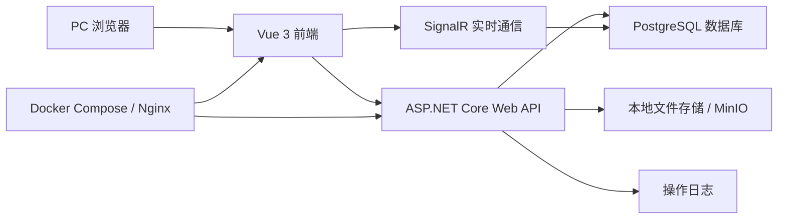
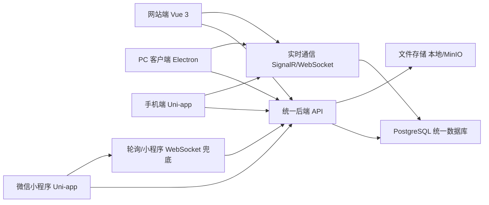

# 仿飞书协同办公平台细化执行版项目方案与人员分配

> 团队配置：4 名开发，2 名运维  
> 项目周期：10 天  
> 交付形态：PC Web + 后端 API + 数据库 + Docker 部署 + 测试文档 + 演示材料  
> 项目策略：压缩范围，打穿主流程，保证可运行、可演示、可验收

## 一、项目定位与最终目标

本项目不是完整复刻飞书全部能力，而是在 10 天内完成一个仿飞书协同办公平台的最小可交付版本。项目重点不是功能数量堆叠，而是完成一条完整、稳定、能展示工程能力的业务闭环。

最终系统需要支持：

1. 管理员登录系统。
2. 管理员维护部门、用户、角色。
3. 普通用户登录系统。
4. 普通用户查看通讯录并搜索同事。
5. 两个普通用户实时聊天。
6. 用户创建、编辑、评论文档。
7. 用户上传、下载文件。
8. 用户创建日程。
9. 用户提交请假审批，管理员审批。
10. 管理员查看操作日志。
11. 系统可通过部署文档启动。
12. 项目有测试报告、接口文档、数据库文档和演示脚本。

## 二、范围细化与功能取舍

### 1. 必做范围

| 模块 | 功能点 | 交付标准 | 优先级 |
| :-- | :-- | :-- | :--: |
| 用户中心 | 登录、退出、当前用户、JWT 鉴权 | 能登录，能保护接口，能区分管理员和普通用户 | P0 |
| 管理后台 | 用户管理、部门管理、角色管理、操作日志 | 管理员可以完成组织基础数据维护 | P0 |
| 通讯录 | 部门树、成员列表、成员搜索、员工名片 | 用户可以按部门和关键词查找人员 | P0 |
| 即时通讯 | 会话列表、单聊、群聊、历史消息、撤回、未读数 | 两个账号能实时收发消息 | P0 |
| 协同文档 | 文档列表、创建、编辑、保存、评论、版本记录 | 用户能编辑文档并保留修改记录 | P0 |
| 云盘 | 文件列表、上传、下载、删除 | 用户可以上传和下载文件 | P0 |
| 通知 | 通知列表、未读数、标记已读 | 聊天、审批等操作可产生通知 | P1 |
| 日历 | 日程新增、查询、编辑、删除 | 用户可创建和查看个人日程 | P1 |
| 审批 | 请假申请、审批列表、通过、驳回 | 用户提交，管理员处理 | P1 |
| 部署 | Docker Compose、环境变量、启动说明 | 可按文档启动依赖和系统 | P0 |
| 文档 | 方案、需求、数据库、接口、测试、部署、复盘 | 验收材料完整 | P0 |

### 2. 降级范围

| 功能 | 标准方案 | 来不及时的降级方案 |
| :-- | :-- | :-- |
| 群聊 | 支持创建群、群成员、群消息 | 预置一个群，只演示群消息 |
| 文档版本 | 每次保存生成版本 | 只保留最近 5 次版本 |
| 文件存储 | MinIO | 本地文件夹存储 |
| 权限系统 | 角色、菜单、按钮权限 | 只区分管理员和普通用户 |
| 日历 | 完整日程管理 | 只做新增和列表 |
| 审批 | 多步骤流程 | 只做提交、通过、驳回 |
| 通知 | 多类型通知 | 只做站内未读提醒 |

### 3. 不做范围

| 模块 | 不做原因 |
| :-- | :-- |
| 视频会议 | 需要音视频和 WebRTC，10 天风险过高 |
| 多端 App、小程序、桌面端 | 适配成本高，当前只做 PC Web |
| SSO、三方登录 | 依赖外部平台配置 |
| OpenAPI、Webhook | 当前先保证业务闭环 |
| Elasticsearch | 部署复杂，先用数据库查询 |
| RabbitMQ | 当前通知可用数据库实现 |

## 三、所需技术与技术选型

### 1. 总体技术架构

本项目采用前后端分离架构，前端负责页面展示和用户交互，后端负责业务接口、数据处理、鉴权、实时通信和文件管理，运维负责环境部署、数据初始化、测试环境和演示环境保障。



### 2. 前端所需技术

| 技术 | 用途 | 负责成员 | 必须掌握程度 |
| :-- | :-- | :-- | :-- |
| HTML5 / CSS3 / JavaScript | 页面结构、样式、基础交互 | B、C | 必须熟练 |
| Vue 3 | 前端主框架，用于开发所有 PC Web 页面 | B、C | 必须掌握组件、响应式、生命周期 |
| Vite | 前端构建和本地开发服务 | B | 会创建项目、启动、打包 |
| Vue Router | 页面路由、登录拦截、权限跳转 | B | 必须掌握路由配置和守卫 |
| Pinia | 登录用户、Token、菜单、未读数等状态管理 | B | 会定义 store 和跨页面使用 |
| Axios | 调用后端接口，统一封装请求和响应 | B、C | 会封装拦截器和错误处理 |
| Element Plus / Naive UI | 表格、表单、弹窗、按钮等后台组件 | B、C | 会使用常见组件 |
| Tailwind CSS，可选 | 快速调整页面布局和样式 | B、C | 会基础类名即可 |
| SignalR JavaScript Client | 连接后端 IM Hub，实现实时聊天 | C | 会连接、监听、发送消息 |
| 富文本编辑器 | 文档编辑功能，可选 WangEditor / Quill | C | 会接入编辑器并获取 HTML 内容 |

前端建议优先使用成熟 UI 组件库，避免把时间浪费在从零写表格、弹窗和表单。10 天周期内不建议自研组件库。

### 3. 后端所需技术

| 技术 | 用途 | 负责成员 | 必须掌握程度 |
| :-- | :-- | :-- | :-- |
| C# | 后端主要开发语言 | A、D | 必须掌握类、接口、异步、LINQ |
| ASP.NET Core Web API | 提供 RESTful 接口 | A、D | 必须掌握 Controller、路由、依赖注入 |
| Entity Framework Core | 数据库 ORM，完成增删改查 | A、D | 会建实体、DbContext、Migration、查询 |
| PostgreSQL | 主数据库，保存用户、消息、文档、文件记录 | A、D、E | 会建表、查数据、导入初始化数据 |
| JWT | 登录鉴权，保护接口 | A | 会生成 Token、校验 Token、获取用户身份 |
| SignalR | 实时通信，用于 IM 单聊、群聊、未读提醒 | D | 会创建 Hub、管理连接、发送消息 |
| Swagger / OpenAPI | 自动生成接口文档，方便联调和验收展示 | A、D | 会配置和访问接口文档 |
| 文件上传下载 | 云盘功能，保存文件和文件记录 | D、E | 会处理 multipart 上传和下载响应 |
| Serilog / 默认日志 | 记录后端运行日志和错误 | A | 会输出日志并定位问题 |

后端建议采用模块化单体结构，不拆微服务。模块可以按 `Auth`、`Admin`、`Org`、`IM`、`Docs`、`Drive`、`Calendar`、`Approval`、`Notification` 划分。

### 4. 数据库与数据设计技术

| 技术/工具 | 用途 | 负责成员 | 说明 |
| :-- | :-- | :-- | :-- |
| PostgreSQL | 项目主数据库 | A、D、E | 推荐使用 Docker 启动 |
| SQL | 初始化数据、排查数据问题 | D、E | 必须准备演示账号和演示数据 |
| EF Core Migration | 管理数据库结构变更 | A、D | 如果时间紧，可直接使用 SQL 初始化脚本 |
| ER 图工具 | 绘制数据库关系图 | A、D、F | 可用 draw.io / ProcessOn |
| 数据库客户端 | 查看和维护数据 | E | 可用 DBeaver、pgAdmin 或 DataGrip |

数据库设计要以够用为主，优先保证登录、通讯录、IM、文档、云盘这些主流程表结构稳定。

### 5. 运维部署所需技术

| 技术 | 用途 | 负责成员 | 必须掌握程度 |
| :-- | :-- | :-- | :-- |
| Docker | 容器化运行数据库、文件服务等依赖 | E | 会拉镜像、启动容器、查看日志 |
| Docker Compose | 一键启动 PostgreSQL、MinIO、后端等服务 | E | 会写 `docker-compose.yml` |
| Nginx | 前端静态资源部署、后端接口代理、WebSocket 转发 | E | 会配置反向代理 |
| 环境变量 | 管理数据库连接、JWT 密钥、文件路径 | E、A | 会编写 `.env.example` |
| PowerShell / Shell | 启动脚本、数据初始化脚本 | E | 会写基础命令 |
| Git | 团队协作、代码提交、分支管理 | 全员 | 必须会 clone、commit、pull、push、merge |
| GitHub / Gitee | 代码托管、Issue、任务协作 | 全员 | 会提交任务和查看代码 |

10 天内部署目标以“可稳定演示”为主，不强制完成完整 CI/CD。若时间允许，可补充简单构建脚本。

### 6. 测试与文档所需技术

| 技术/工具 | 用途 | 负责成员 | 说明 |
| :-- | :-- | :-- | :-- |
| Swagger | 接口测试和接口截图 | A、D、F | 用于展示接口完整性 |
| Postman / Apifox | 接口联调和测试用例管理 | F、A、D | 推荐 Apifox，更适合中文团队 |
| Markdown | 编写项目文档、日报、测试报告 | F、全员 | 所有文档统一使用 `.md` |
| draw.io / ProcessOn | 架构图、流程图、ER 图 | F、A、D | 每类核心文档至少有图 |
| Snipaste / 截图工具 | 保存页面、接口、测试截图 | F、全员 | 每天收集截图 |
| Excel / 表格 | Bug 清单、测试用例清单 | F | 可用 Markdown 表格替代 |

测试不追求复杂自动化，重点是功能测试、边界测试和演示路线回归测试。

### 7. 推荐目录结构

```text
fang-feishu-app-class2-group7/
├── apps/
│   ├── web/                 # 网站端，Vue 3 + Vite
│   ├── desktop/             # PC 客户端，Electron 包装 web
│   └── mobile-uni/          # 手机端 App + 微信小程序，Uni-app
├── packages/
│   ├── api-sdk/             # 多端共用 API 请求封装
│   └── shared/              # 共用类型、常量、工具函数
├── frontend/
│   └── pc-web/              # 如果不采用 apps 目录，可保留原前端目录
├── backend/
│   ├── src/
│   ├── tests/
│   └── scripts/
├── deploy/
│   ├── docker/
│   ├── nginx/
│   └── init-sql/
├── docs/
│   ├── 01-需求分析/
│   ├── 02-数据库设计/
│   ├── 03-接口设计/
│   ├── 04-开发文档/
│   ├── 05-测试报告/
│   ├── 06-部署文档/
│   └── 07-项目复盘/
└── README.md
```

推荐采用 `apps + packages` 的结构，便于四端复用接口、类型和工具函数。如果时间紧，也可以保留 README 原目录，但必须保证四端请求同一套后端 API。

### 8. 开发环境要求

| 环境 | 建议版本 | 用途 |
| :-- | :-- | :-- |
| Node.js | 18 或以上 | 前端项目运行 |
| pnpm / npm | pnpm 8 或 npm 9 以上 | 前端依赖管理 |
| .NET SDK | 8 或以上 | 后端项目开发 |
| PostgreSQL | 16 或以上 | 数据库存储 |
| Docker | 24 或以上 | 运行数据库和依赖服务 |
| Git | 最新稳定版 | 代码管理 |
| VS Code / Visual Studio | 任意稳定版 | 开发工具 |

说明：README 中写的是 .NET 10，但实际开发环境如果无法安装 .NET 10，可以使用 .NET 8 LTS。项目汇报时说明“实训落地采用 .NET 8 LTS，后续可升级到 .NET 10”即可。

### 9. 技术难点与解决方案

| 技术难点 | 可能问题 | 解决方案 |
| :-- | :-- | :-- |
| SignalR 实时聊天 | 连接失败、消息不同步 | 先跑通单聊，再做群聊；保留 HTTP 发送消息兜底 |
| JWT 权限 | Token 过期、接口未拦截 | 前端统一拦截 401，后端统一鉴权中间件 |
| 文件上传 | MinIO 配置耗时 | 先实现本地文件存储，MinIO 作为加分项 |
| 文档编辑 | 富文本内容保存异常 | 使用成熟编辑器，正文按 HTML 字符串保存 |
| 部署环境 | 本机和演示机环境不一致 | 全部依赖用 Docker Compose 固化 |
| 多人协作 | 接口变更影响前端 | 每天固定接口评审，变更写入接口文档 |

### 10. 技术分工汇总

| 成员 | 重点技术 |
| :-- | :-- |
| 成员 A | ASP.NET Core、JWT、EF Core、Swagger、后端架构 |
| 成员 B | Vue 3、Vue Router、Pinia、Axios、UI 组件库 |
| 成员 C | Vue 3 业务页面、SignalR 前端、富文本编辑器、文件上传组件 |
| 成员 D | ASP.NET Core、SignalR、EF Core、文件上传下载、业务接口 |
| 成员 E | Docker、Docker Compose、PostgreSQL、Nginx、初始化脚本 |
| 成员 F | Markdown、Apifox/Postman、测试用例、Bug 管理、截图和验收文档 |

## 四、四端数据互通技术方案

### 1. 四端交付目标

本项目需要同时支持网站端、PC 客户端、手机端和微信小程序四种访问方式，并且四端之间数据互通。所谓数据互通，是指同一用户账号、同一组织架构、同一聊天消息、同一文档、同一云盘文件、同一审批和日程数据，在四端访问时保持一致。

| 端 | 交付形态 | 推荐技术 | 功能范围 |
| :-- | :-- | :-- | :-- |
| 网站端 | 浏览器访问 | Vue 3 + Vite | 完整 MVP 功能，作为主开发端 |
| PC 客户端 | Windows 桌面应用 | Electron | 复用网站端页面和接口，打包成桌面客户端 |
| 手机端 | Android/iOS App 或移动 H5 | Uni-app | 移动端核心功能，重点做登录、通讯录、IM、文档、云盘 |
| 微信小程序 | 微信内访问 | Uni-app 编译到 mp-weixin | 复用移动端代码，做核心功能演示 |

10 天周期内，建议四端功能分层：

1. 网站端功能最完整，是主要验收端。
2. PC 客户端通过 Electron 复用网站端，保证快速交付。
3. 手机端和微信小程序共用 Uni-app 代码，优先完成核心页面。
4. 所有端都连接同一个后端 API 和同一个数据库，不做本地独立数据。

### 2. 四端数据互通核心原则

| 原则 | 说明 |
| :-- | :-- |
| 统一后端 | 四端都请求同一套 ASP.NET Core API |
| 统一数据库 | 所有业务数据存储在同一个 PostgreSQL 数据库 |
| 统一账号 | 四端使用同一套用户体系和 JWT 鉴权 |
| 统一接口 | 登录、通讯录、IM、文档、云盘等接口路径保持一致 |
| 统一文件服务 | 文件统一上传到后端文件服务，由后端返回文件访问地址 |
| 统一消息通道 | Web/PC 优先用 SignalR，移动端和小程序使用 WebSocket 或轮询兜底 |
| 统一数据格式 | 接口统一返回 `{ code, message, data, traceId }` |
| 服务端为准 | 所有数据以服务端数据库为准，客户端不保存独立业务数据 |

### 3. 四端技术选型

| 层级 | 使用技术 | 作用 |
| :-- | :-- | :-- |
| 网站端 | Vue 3 + Vite + Pinia + Vue Router + Axios | 完整 PC Web 功能开发 |
| PC 客户端 | Electron | 将网站端打包成桌面应用 |
| 手机端 | Uni-app + Vue 3 | 编译为 Android/iOS App 或移动 H5 |
| 微信小程序 | Uni-app 编译到 mp-weixin | 复用移动端页面和业务逻辑 |
| API SDK | TypeScript 封装请求方法 | 四端复用接口地址、类型、错误处理 |
| 后端 API | ASP.NET Core Web API | 提供统一业务接口 |
| 实时通信 | SignalR / WebSocket / 轮询兜底 | 聊天和通知实时同步 |
| 数据库 | PostgreSQL | 保存统一业务数据 |
| 文件服务 | 本地文件存储 / MinIO | 保存云盘和聊天文件 |
| 部署 | Docker Compose + Nginx | 统一部署 API、Web、数据库和文件服务 |

### 4. 四端互通架构



### 5. 四端分别怎么完成

#### 网站端怎么完成

网站端作为主线端，完成最完整功能。

| 内容 | 做法 |
| :-- | :-- |
| 工程 | 使用 Vue 3 + Vite 创建 `apps/web` |
| 登录 | Axios 调用 `/api/v1/auth/login`，Token 存入 localStorage |
| 权限 | Vue Router 路由守卫判断 Token 和角色 |
| 页面 | 完成后台、通讯录、IM、文档、云盘、日历、审批 |
| 实时聊天 | 使用 SignalR JavaScript Client 连接 `/hubs/im` |
| 文件上传 | 使用浏览器上传组件调用 `/api/v1/files/upload` |

#### PC 客户端怎么完成

PC 客户端不重新开发一套页面，直接复用网站端。

| 内容 | 做法 |
| :-- | :-- |
| 工程 | 使用 Electron 创建 `apps/desktop` |
| 页面来源 | 加载网站端构建后的静态资源，或开发时加载 `http://localhost:5173` |
| 数据互通 | 所有接口仍请求统一后端 API |
| 登录状态 | 与网站端一样使用 Token，本地存储在 Electron 渲染进程中 |
| 打包 | 使用 electron-builder 打包 Windows `.exe` |
| 可选能力 | 后续可增加桌面通知、自动更新、托盘图标 |

10 天内 PC 客户端只要求“能打开、能登录、能使用网站端功能”，不要额外开发复杂桌面能力。

#### 手机端怎么完成

手机端推荐使用 Uni-app，因为它可以同时覆盖 App、H5 和微信小程序。

| 内容 | 做法 |
| :-- | :-- |
| 工程 | 使用 Uni-app 创建 `apps/mobile-uni` |
| 页面 | 优先完成移动端登录、通讯录、IM、文档列表、云盘列表 |
| 请求 | 使用 `uni.request` 调用同一套后端 API |
| 登录状态 | Token 存入 `uni.setStorageSync` |
| 文件上传 | 使用 `uni.uploadFile` 调用统一上传接口 |
| 实时通信 | App 可尝试 WebSocket；不稳定时用消息列表定时刷新 |

手机端不建议 10 天内追求完整后台管理功能，后台管理保留在网站端和 PC 客户端。

#### 微信小程序怎么完成

微信小程序使用 Uni-app 编译到 `mp-weixin`，与手机端复用大部分代码。

| 内容 | 做法 |
| :-- | :-- |
| 工程 | 使用 Uni-app 同一工程编译为微信小程序 |
| 请求 | 使用 `uni.request`，请求统一后端 API |
| 登录 | 第一版可使用账号密码登录；后续再接微信 `code2Session` |
| Token | 存入小程序本地 storage |
| 文件上传 | 使用 `uni.uploadFile` |
| 实时消息 | 优先轮询消息列表；时间允许再使用小程序 WebSocket |
| 配置要求 | 需要配置合法请求域名，正式环境必须使用 HTTPS |

10 天内小程序建议完成“登录、通讯录、聊天、文档列表、文件列表”即可，复杂后台管理不放入小程序。

### 6. 四端共享代码怎么做

为了避免四端重复写接口地址和数据格式，建议抽出共用包：

```text
packages/
├── api-sdk/
│   ├── auth.ts
│   ├── users.ts
│   ├── contacts.ts
│   ├── im.ts
│   ├── documents.ts
│   ├── files.ts
│   ├── calendar.ts
│   └── approvals.ts
└── shared/
    ├── types.ts
    ├── constants.ts
    └── validators.ts
```

| 共用内容 | 说明 |
| :-- | :-- |
| 接口路径 | 统一维护 `/api/v1/...` |
| 数据类型 | 用户、消息、文档、文件、审批等 TypeScript 类型 |
| 状态码 | 登录失效、权限不足、参数错误等错误码 |
| 工具函数 | 时间格式化、文件大小格式化、空值判断 |

注意：网站端和 PC 客户端可以直接使用 Axios 版本的 API SDK；Uni-app 端需要使用 `uni.request` 适配器。可以把接口定义共用，请求实现按平台适配。

### 7. 登录与账号互通方案

第一版使用统一账号密码登录，四端都拿到后端签发的 JWT。

| 端 | 登录方式 | Token 保存位置 |
| :-- | :-- | :-- |
| 网站端 | 用户名 + 密码 | localStorage |
| PC 客户端 | 用户名 + 密码 | Electron 本地存储/localStorage |
| 手机端 | 用户名 + 密码 | uni storage |
| 微信小程序 | 用户名 + 密码，后续可绑定微信 openid | 小程序 storage |

后续如果要接微信登录，可以增加：

1. 小程序调用 `wx.login` 获取 code。
2. 后端调用微信接口换取 openid。
3. openid 绑定系统用户。
4. 后端仍返回系统 JWT。
5. 小程序后续用 JWT 请求业务接口。

### 8. IM 多端同步方案

IM 数据互通的关键是消息必须先落库，再通过实时通道推送。

消息发送流程：

1. 用户 A 在任意端发送消息。
2. 客户端调用后端发送消息接口或 SignalR Hub。
3. 后端校验用户身份和会话成员关系。
4. 后端把消息写入 `messages` 表。
5. 后端通过 SignalR/WebSocket 推送给在线用户。
6. 不在线的端下次进入会话时通过历史消息接口拉取。
7. 未读数根据 `conversation_members.last_read_message_id` 计算。

| 场景 | 处理方式 |
| :-- | :-- |
| 网站端和 PC 客户端在线 | SignalR 实时推送 |
| 手机端在线 | WebSocket 或轮询 |
| 小程序在线 | 小程序 WebSocket 或轮询 |
| 用户离线 | 进入会话后拉取历史消息 |
| 多端同时登录 | 服务端按用户 ID 推送到多个连接 |

### 9. 文件与文档多端同步方案

文档和文件不在客户端保存独立副本，统一由服务端保存。

| 模块 | 同步方式 |
| :-- | :-- |
| 文档 | 编辑后调用保存接口，内容写入 `documents` 表 |
| 文档版本 | 每次保存生成 `document_versions` 记录 |
| 评论 | 评论写入 `document_comments` 表，其他端刷新后可见 |
| 文件 | 上传到后端文件服务，记录写入 `files` 表 |
| 下载 | 各端通过统一下载接口获取文件 |

10 天内不做离线编辑，也不做复杂冲突合并。若两端同时编辑，以最后一次保存为准，并用版本记录保留历史。

### 10. 四端开发优先级

| 优先级 | 端 | 原因 |
| :-- | :-- | :-- |
| 1 | 网站端 | 功能最完整，作为核心验收端 |
| 2 | 后端 API | 四端互通的基础 |
| 3 | PC 客户端 | 复用网站端，投入少，见效快 |
| 4 | 手机端 | 用 Uni-app 完成移动核心流程 |
| 5 | 微信小程序 | 复用 Uni-app，做核心流程演示 |

### 11. 10 天内四端落地节奏

| 时间 | 四端相关任务 |
| :-- | :-- |
| Day 1 | 确定四端架构，建立 `web`、`desktop`、`mobile-uni` 目录 |
| Day 2 | 完成统一登录接口，网站端先联调 |
| Day 3 | 网站端完成后台和通讯录，移动端开始登录页 |
| Day 4 | 网站端跑通 IM，移动端完成通讯录 |
| Day 5 | PC 客户端打包网站端中期版本 |
| Day 6 | 移动端完成 IM 基础页面，小程序尝试编译 |
| Day 7 | 移动端和小程序接入文档、云盘列表 |
| Day 8 | 四端共同联调登录、通讯录、IM、文件列表 |
| Day 9 | 准备四端截图、打包包体、演示材料 |
| Day 10 | 展示网站端完整流程，展示 PC 客户端、手机端、小程序数据互通 |

### 12. 四端验收标准

| 端 | 最低验收标准 |
| :-- | :-- |
| 网站端 | 完整跑通登录、后台、通讯录、IM、文档、云盘、日历、审批 |
| PC 客户端 | 能打开客户端，登录同一账号，看到同一套数据 |
| 手机端 | 能登录，查看通讯录，发送/查看消息，查看文档和文件 |
| 微信小程序 | 能登录，查看通讯录，查看/发送消息，查看文档和文件 |

四端互通演示建议：

1. 网站端管理员创建用户和部门。
2. 手机端登录同一普通用户，能看到刚创建的部门和用户。
3. 网站端用户 A 给用户 B 发消息。
4. PC 客户端或小程序用户 B 收到或刷新看到同一条消息。
5. 网站端上传文件。
6. 手机端或小程序文件列表中能看到该文件。

### 13. 四端风险与降级方案

| 风险 | 表现 | 降级方案 |
| :-- | :-- | :-- |
| 四端工作量过大 | 页面开发来不及 | 网站端完整，其他三端只做核心查看和聊天 |
| 小程序实时通信不稳定 | 收不到实时消息 | 使用 3 到 5 秒轮询消息列表 |
| PC 客户端打包失败 | Electron 配置耗时 | 演示 Electron 开发模式或本地壳加载 Web 地址 |
| 手机 App 打包耗时 | 证书和打包环境复杂 | 先交付移动 H5 或 HBuilderX 运行效果 |
| Uni-app 与 Web 代码难复用 | 组件语法差异 | 只复用 API 和类型，不强行复用页面组件 |
| HTTPS 域名不足 | 小程序无法请求正式接口 | 本地演示可用开发者工具“不校验合法域名”，正式说明需配置 HTTPS |

## 五、人员职责细化

### 0. 人员工作分配速览总结

本项目按照“4 个开发 + 2 个运维”的方式推进。每个人都必须清楚自己的主责范围、协作对象、每日产出和需要掌握的技术能力。

| 成员 | 岗位定位 | 一句话职责 | 主要工作内容 | 每日必须产出 | 需要具备的能力 |
| :-- | :-- | :-- | :-- | :-- | :-- |
| 成员 A | 组长 / 后端负责人 | 负责项目方向、后端框架和核心权限能力 | 拆分任务、把控进度、搭建后端、完成登录/JWT/权限、统一接口规范、Review 后端代码 | 当日后端接口进度、接口变更说明、风险问题记录 | ASP.NET Core、C#、JWT、EF Core、Swagger、数据库基础、项目协调能力 |
| 成员 B | 前端负责人 | 负责前端整体框架、登录权限和管理后台 | 搭建 Vue 项目、配置路由和状态管理、封装 Axios、完成登录页、主布局、后台管理页面、统一 UI 风格 | 可运行页面、页面截图、前端问题清单 | Vue 3、Vite、Vue Router、Pinia、Axios、Element Plus/Naive UI、前端组件化能力 |
| 成员 C | 前端业务开发 | 负责用户能看到和操作的核心业务页面 | 开发通讯录、IM 聊天、文档编辑、云盘、日历、审批等页面，配合后端联调接口 | 业务页面截图、联调结果、前端 Bug 记录 | Vue 3、页面布局、接口联调、SignalR 前端接入、文件上传组件、富文本编辑器使用 |
| 成员 D | 后端业务开发 | 负责核心业务模块接口和数据处理 | 开发通讯录、IM、文档、云盘、通知、日历、审批接口，设计业务表，处理 SignalR 消息逻辑 | 已完成接口列表、Swagger 接口截图、数据库变更说明 | ASP.NET Core、EF Core、PostgreSQL、SignalR、文件上传下载、RESTful API 设计 |
| 成员 E | 运维 / 环境 / 数据 | 负责项目能稳定跑起来和有演示数据 | 搭建 Docker 环境、配置 PostgreSQL/MinIO/Nginx、准备初始化数据、维护演示环境、编写部署文档 | 环境启动截图、初始化数据脚本、部署问题记录 | Docker、Docker Compose、Nginx、PostgreSQL、环境变量、基础 Shell/PowerShell、故障排查 |
| 成员 F | 测试 / 文档 / 验收 | 负责项目过程可追溯、结果可验收 | 编写测试用例、执行测试、登记 Bug、收集截图、维护日报、整理测试报告、演示脚本和验收材料 | 日报、Bug 清单、测试记录、截图材料 | Markdown、Apifox/Postman、Swagger、测试用例设计、Bug 跟踪、文档整理、沟通协调 |

### 工作边界说明

| 类型 | 负责内容 | 不主要负责内容 |
| :-- | :-- | :-- |
| 开发成员 A-D | 功能开发、接口联调、页面实现、代码修复 | 不把主要时间放在部署文档和测试报告上 |
| 运维成员 E | 环境部署、数据初始化、演示环境稳定 | 不负责大量业务代码开发 |
| 运维成员 F | 测试、文档、截图、验收材料 | 不负责核心功能代码实现 |

### 协作关系

| 协作组合 | 协作内容 |
| :-- | :-- |
| A + B | 登录、权限、菜单、接口规范联调 |
| B + C | 前端页面风格统一、组件复用、路由接入 |
| C + D | 通讯录、IM、文档、云盘、日历、审批业务联调 |
| A + D | 后端架构、数据库、接口 Review |
| D + E | 数据库表结构、初始化数据、文件服务配置 |
| 全员 + F | 测试反馈、Bug 修复、截图和验收材料整理 |

### 每个人最重要的验收结果

| 成员 | 最终要证明的成果 |
| :-- | :-- |
| 成员 A | 后端接口规范统一，登录权限稳定，整体项目进度可控 |
| 成员 B | 前端框架完整，登录、菜单、后台管理可正常演示 |
| 成员 C | 通讯录、IM、文档、云盘等核心页面能完整跑通 |
| 成员 D | 核心业务接口可用，数据能正确写入和查询 |
| 成员 E | 项目环境能稳定启动，演示数据完整，部署文档清楚 |
| 成员 F | 测试报告、Bug 清单、截图、演示脚本和验收文档齐全 |

### 1. 总体角色

| 成员 | 类型 | 角色 | 核心目标 |
| :-- | :-- | :-- | :-- |
| 成员 A | 开发 | 组长 / 后端负责人 | 控进度、定接口、搭后端、做登录权限、兜底后端问题 |
| 成员 B | 开发 | 前端负责人 | 搭前端、做布局权限、做后台、统一 UI 和交互 |
| 成员 C | 开发 | 前端业务开发 | 做通讯录、IM、文档、云盘、日历、审批业务页面 |
| 成员 D | 开发 | 后端业务开发 | 做通讯录、IM、文档、云盘、通知、日历、审批接口 |
| 成员 E | 运维 | 环境部署 / 数据运维 | 管 Docker、数据库、文件存储、演示环境、初始化数据 |
| 成员 F | 运维 | 测试文档 / 验收运维 | 管测试、Bug、日报、截图、文档、演示脚本、验收报告 |

### 2. 成员 A 详细职责

| 类别 | 具体任务 |
| :-- | :-- |
| 项目管理 | 制定每日目标，晚上检查完成情况，调整第二天任务 |
| 后端架构 | 建立 API 项目结构、统一响应、异常处理、Swagger |
| 登录权限 | 登录接口、JWT 生成、用户上下文、管理员/普通用户权限 |
| 接口规范 | 统一 `/api/v1` 前缀、错误码、分页格式、返回结构 |
| 代码把关 | Review 成员 D 的核心接口，保证接口可联调 |
| 演示支持 | 负责答辩时说明总体架构和后端设计 |

### 3. 成员 B 详细职责

| 类别 | 具体任务 |
| :-- | :-- |
| 前端架构 | 建立 Vue 项目、路由、Pinia、Axios、布局组件 |
| 权限与菜单 | 登录页、路由守卫、动态菜单、管理员后台入口 |
| 管理后台 | 用户管理、部门管理、角色管理、操作日志页面 |
| UI 统一 | 按统一风格整理表格、表单、弹窗、按钮、提示 |
| 联调支持 | 配合 A、D 完成后台接口联调 |
| 演示支持 | 负责答辩时演示登录、首页、管理后台 |

### 4. 成员 C 详细职责

| 类别 | 具体任务 |
| :-- | :-- |
| 通讯录页面 | 部门树、成员列表、成员搜索、员工名片弹窗 |
| IM 页面 | 会话列表、聊天窗口、消息发送、撤回、未读数展示 |
| 文档页面 | 文档列表、文档编辑、评论区、版本入口 |
| 云盘页面 | 文件列表、上传、下载、删除 |
| 扩展页面 | 日历页面、审批页面 |
| 演示支持 | 负责答辩时演示通讯录、IM、文档、云盘 |

### 5. 成员 D 详细职责

| 类别 | 具体任务 |
| :-- | :-- |
| 组织接口 | 部门树、成员列表、成员搜索、员工名片 |
| IM 接口 | 会话、成员、消息、SignalR、撤回、未读 |
| 文档接口 | 文档 CRUD、保存、评论、版本记录 |
| 云盘接口 | 文件上传、下载、删除、文件记录 |
| 业务接口 | 通知、日程、请假审批 |
| 演示支持 | 负责答辩时说明数据库、接口和核心业务逻辑 |

### 6. 成员 E 详细职责

| 类别 | 具体任务 |
| :-- | :-- |
| 开发环境 | Docker Compose 启动 PostgreSQL、Redis 可选、MinIO 可选 |
| 数据初始化 | 准备管理员、普通用户、部门、角色、示例消息、示例文档 |
| 文件环境 | 配置文件上传目录或 MinIO Bucket |
| 演示环境 | Day 5、Day 8、Day 10 各准备一次可运行环境 |
| 部署文档 | 写清安装依赖、启动命令、环境变量、常见问题 |
| 演示支持 | 负责答辩时说明部署和数据初始化 |

### 7. 成员 F 详细职责

| 类别 | 具体任务 |
| :-- | :-- |
| 测试管理 | 编写测试用例，执行测试，登记 Bug，跟踪修复 |
| 文档管理 | 维护项目方案、需求说明、接口记录、日报、复盘 |
| 截图收集 | 每天收集运行截图、接口截图、测试截图 |
| 验收材料 | 输出测试报告、演示脚本、验收报告 |
| 进度辅助 | 每天记录完成项、风险、阻塞点 |
| 演示支持 | 负责答辩时说明测试结果和文档成果 |

## 六、模块工作包拆解

### 1. 用户中心与权限

| 工作包 | 前端任务 | 后端任务 | 运维/测试任务 | 负责人 |
| :-- | :-- | :-- | :-- | :-- |
| 登录 | 登录页、表单校验、登录请求 | 登录接口、密码校验、JWT 生成 | 登录测试用例 | A、B、F |
| 当前用户 | 保存 Token、获取用户信息 | `/auth/me` 接口 | 校验 Token 过期场景 | A、B、F |
| 权限 | 路由守卫、菜单显示控制 | 管理员/普通用户识别 | 权限测试截图 | A、B、F |
| 退出 | 清理 Token、跳转登录页 | 可选退出接口 | 退出测试 | B、F |

验收点：

1. 未登录访问系统会跳转登录页。
2. 管理员能看到管理后台菜单。
3. 普通用户看不到后台管理入口。
4. Token 失效后重新登录。

### 2. 管理后台

| 工作包 | 前端任务 | 后端任务 | 运维/测试任务 | 负责人 |
| :-- | :-- | :-- | :-- | :-- |
| 用户管理 | 列表、新增、编辑、禁用 | 用户 CRUD | 准备测试用户 | A、B、D、F |
| 部门管理 | 部门树、新增、编辑、删除 | 部门 CRUD | 准备部门数据 | B、D、E、F |
| 角色管理 | 角色列表、授权简化 | 角色 CRUD、用户分配角色 | 权限测试 | A、B、D、F |
| 操作日志 | 日志列表、条件查询 | 写入操作日志、查询接口 | 日志截图 | A、B、F |

验收点：

1. 管理员能新增普通用户。
2. 管理员能创建部门并分配用户。
3. 用户操作后能在日志中查看记录。

### 3. 通讯录

| 工作包 | 前端任务 | 后端任务 | 运维/测试任务 | 负责人 |
| :-- | :-- | :-- | :-- | :-- |
| 部门树 | 左侧部门树 | 部门树接口 | 初始化 3 个部门 | C、D、E |
| 成员列表 | 按部门展示成员 | 部门成员接口 | 初始化 4 个成员 | C、D、E |
| 搜索 | 搜索框、结果列表 | 按姓名、手机号、邮箱搜索 | 搜索测试 | C、D、F |
| 名片 | 成员详情弹窗 | 员工名片接口 | 截图文档 | C、D、F |

验收点：

1. 点击部门能看到成员。
2. 输入姓名能搜索到成员。
3. 点击成员能看到姓名、部门、职位、邮箱、手机号。

### 4. 即时通讯

| 工作包 | 前端任务 | 后端任务 | 运维/测试任务 | 负责人 |
| :-- | :-- | :-- | :-- | :-- |
| 会话列表 | 展示最近会话、未读数 | 会话列表接口 | 准备双账号 | C、D、F |
| 单聊 | 聊天窗口、发送文本 | SignalR 单聊消息 | 双浏览器测试 | C、D、F |
| 群聊 | 群会话、群消息 | 群成员和群消息 | 预置测试群 | C、D、E |
| 历史消息 | 分页加载消息 | 消息分页接口 | 历史记录测试 | C、D、F |
| 撤回 | 撤回按钮、撤回状态 | 撤回接口 | 撤回测试 | C、D、F |
| 未读 | 未读角标、进入会话清零 | 未读数、已读接口 | 未读测试 | B、C、D、F |

验收点：

1. 用户 A 发消息，用户 B 实时收到。
2. 刷新页面后能看到历史消息。
3. 消息撤回后双方看到撤回状态。
4. 未读数能展示并在进入会话后清零。

### 5. 协同文档

| 工作包 | 前端任务 | 后端任务 | 运维/测试任务 | 负责人 |
| :-- | :-- | :-- | :-- | :-- |
| 文档列表 | 列表、新建按钮、搜索 | 文档列表接口 | 准备示例文档 | C、D、E |
| 文档编辑 | 标题、正文编辑、保存 | 文档创建、保存、详情 | 保存测试 | C、D、F |
| 评论 | 评论列表、发表评论 | 评论新增、查询 | 评论测试 | C、D、F |
| 版本 | 版本列表入口 | 保存时生成版本记录 | 版本测试 | C、D、F |

验收点：

1. 用户可以新建文档。
2. 编辑正文后刷新仍能看到内容。
3. 其他用户可以评论。
4. 可以看到至少一条版本记录。

### 6. 云盘

| 工作包 | 前端任务 | 后端任务 | 运维/测试任务 | 负责人 |
| :-- | :-- | :-- | :-- | :-- |
| 文件列表 | 表格、文件大小、上传人、时间 | 文件列表接口 | 准备示例文件 | C、D、E |
| 上传 | 上传组件、进度提示 | 上传接口、保存文件记录 | 文件环境配置 | C、D、E |
| 下载 | 下载按钮 | 下载接口 | 下载测试 | C、D、F |
| 删除 | 删除确认弹窗 | 删除接口 | 删除测试 | C、D、F |

验收点：

1. 用户能上传文件。
2. 上传后列表能出现记录。
3. 点击下载能获取原文件。
4. 删除后列表不再显示该文件。

### 7. 日历与审批

| 模块 | 页面任务 | 接口任务 | 验收点 | 负责人 |
| :-- | :-- | :-- | :-- | :-- |
| 日历 | 日程列表、新增、编辑、删除 | 日程 CRUD | 用户可创建个人日程 | B、C、D |
| 审批 | 请假申请、审批列表、审批详情 | 提交、通过、驳回 | 用户提交，管理员审批 | B、C、D |

降级标准：

1. 日历如果来不及，只保留日程列表和新增。
2. 审批如果来不及，只保留提交和通过。

## 七、数据库表字段细化

### 1. 用户与权限

| 表名 | 核心字段 |
| :-- | :-- |
| `users` | `id`、`username`、`password_hash`、`real_name`、`email`、`phone`、`department_id`、`status`、`created_at` |
| `roles` | `id`、`role_name`、`role_code`、`description`、`created_at` |
| `user_roles` | `id`、`user_id`、`role_id` |
| `operation_logs` | `id`、`user_id`、`action`、`module`、`target_id`、`ip`、`created_at` |

### 2. 通讯录

| 表名 | 核心字段 |
| :-- | :-- |
| `departments` | `id`、`parent_id`、`name`、`sort_order`、`created_at` |
| `employee_profiles` | `id`、`user_id`、`position`、`avatar_url`、`work_place`、`bio` |

### 3. IM

| 表名 | 核心字段 |
| :-- | :-- |
| `conversations` | `id`、`type`、`title`、`created_by`、`created_at` |
| `conversation_members` | `id`、`conversation_id`、`user_id`、`last_read_message_id`、`joined_at` |
| `messages` | `id`、`conversation_id`、`sender_id`、`content`、`message_type`、`file_id`、`is_recalled`、`created_at` |

### 4. 文档与云盘

| 表名 | 核心字段 |
| :-- | :-- |
| `documents` | `id`、`title`、`content`、`owner_id`、`updated_by`、`created_at`、`updated_at` |
| `document_comments` | `id`、`document_id`、`user_id`、`content`、`created_at` |
| `document_versions` | `id`、`document_id`、`content_snapshot`、`created_by`、`created_at` |
| `files` | `id`、`file_name`、`file_path`、`file_size`、`content_type`、`uploader_id`、`created_at` |

### 5. 通知、日历、审批

| 表名 | 核心字段 |
| :-- | :-- |
| `notifications` | `id`、`user_id`、`title`、`content`、`type`、`is_read`、`created_at` |
| `calendar_events` | `id`、`user_id`、`title`、`start_time`、`end_time`、`location`、`description` |
| `approval_instances` | `id`、`applicant_id`、`type`、`title`、`content`、`status`、`created_at` |
| `approval_records` | `id`、`instance_id`、`approver_id`、`action`、`comment`、`created_at` |

## 八、接口清单细化

### 1. 登录与用户

| 方法 | 路径 | 说明 | 负责人 |
| :-- | :-- | :-- | :-- |
| `POST` | `/api/v1/auth/login` | 登录 | A |
| `GET` | `/api/v1/auth/me` | 当前用户 | A |
| `GET` | `/api/v1/users` | 用户列表 | A |
| `POST` | `/api/v1/users` | 新增用户 | A |
| `PUT` | `/api/v1/users/{id}` | 编辑用户 | A |
| `PATCH` | `/api/v1/users/{id}/status` | 启用/禁用用户 | A |

### 2. 部门与通讯录

| 方法 | 路径 | 说明 | 负责人 |
| :-- | :-- | :-- | :-- |
| `GET` | `/api/v1/departments/tree` | 部门树 | D |
| `POST` | `/api/v1/departments` | 新增部门 | D |
| `PUT` | `/api/v1/departments/{id}` | 编辑部门 | D |
| `DELETE` | `/api/v1/departments/{id}` | 删除部门 | D |
| `GET` | `/api/v1/contacts` | 成员列表 | D |
| `GET` | `/api/v1/contacts/search` | 成员搜索 | D |
| `GET` | `/api/v1/contacts/{id}` | 员工名片 | D |

### 3. IM

| 方法 | 路径 | 说明 | 负责人 |
| :-- | :-- | :-- | :-- |
| `GET` | `/api/v1/im/conversations` | 会话列表 | D |
| `POST` | `/api/v1/im/conversations` | 创建会话 | D |
| `GET` | `/api/v1/im/conversations/{id}/messages` | 历史消息 | D |
| `POST` | `/api/v1/im/messages` | 发送消息，HTTP 兜底 | D |
| `PATCH` | `/api/v1/im/messages/{id}/recall` | 撤回消息 | D |
| `PATCH` | `/api/v1/im/conversations/{id}/read` | 标记已读 | D |
| `Hub` | `/hubs/im` | SignalR 实时通信 | D |

### 4. 文档、云盘、通知

| 方法 | 路径 | 说明 | 负责人 |
| :-- | :-- | :-- | :-- |
| `GET` | `/api/v1/documents` | 文档列表 | D |
| `POST` | `/api/v1/documents` | 新建文档 | D |
| `GET` | `/api/v1/documents/{id}` | 文档详情 | D |
| `PUT` | `/api/v1/documents/{id}` | 保存文档 | D |
| `POST` | `/api/v1/documents/{id}/comments` | 发表评论 | D |
| `GET` | `/api/v1/documents/{id}/versions` | 版本列表 | D |
| `GET` | `/api/v1/files` | 文件列表 | D |
| `POST` | `/api/v1/files/upload` | 上传文件 | D |
| `GET` | `/api/v1/files/{id}/download` | 下载文件 | D |
| `DELETE` | `/api/v1/files/{id}` | 删除文件 | D |
| `GET` | `/api/v1/notifications` | 通知列表 | D |
| `GET` | `/api/v1/notifications/unread-count` | 未读数 | D |
| `PATCH` | `/api/v1/notifications/{id}/read` | 标记已读 | D |

### 5. 日历与审批

| 方法 | 路径 | 说明 | 负责人 |
| :-- | :-- | :-- | :-- |
| `GET` | `/api/v1/calendar/events` | 日程列表 | D |
| `POST` | `/api/v1/calendar/events` | 新增日程 | D |
| `PUT` | `/api/v1/calendar/events/{id}` | 编辑日程 | D |
| `DELETE` | `/api/v1/calendar/events/{id}` | 删除日程 | D |
| `GET` | `/api/v1/approvals` | 审批列表 | D |
| `POST` | `/api/v1/approvals` | 提交审批 | D |
| `PATCH` | `/api/v1/approvals/{id}/approve` | 通过审批 | D |
| `PATCH` | `/api/v1/approvals/{id}/reject` | 驳回审批 | D |

## 九、10 天排期细化

### Day 1：启动与基础工程

| 时间 | 成员 A | 成员 B | 成员 C | 成员 D | 成员 E | 成员 F |
| :-- | :-- | :-- | :-- | :-- | :-- | :-- |
| 上午 | 冻结 MVP 范围，拆任务 | 初始化前端 | 梳理页面结构 | 设计业务表 | 搭 Docker 环境 | 建文档目录 |
| 下午 | 初始化后端，Swagger | 主布局、路由 | 画核心页面草图 | 补 IM/文档/云盘表 | 配数据库 | 建测试模板 |
| 当日交付 | 后端可启动 | 前端可启动 | 页面草图 | 表结构初稿 | 数据库可连 | 日报和验收清单 |

### Day 2：登录权限

| 时间 | 成员 A | 成员 B | 成员 C | 成员 D | 成员 E | 成员 F |
| :-- | :-- | :-- | :-- | :-- | :-- | :-- |
| 上午 | 登录、JWT 接口 | 登录页 | 通讯录页面框架 | 用户/部门接口 | 初始化用户数据 | 登录测试用例 |
| 下午 | 当前用户、权限 | 路由守卫、菜单 | 成员列表 UI | 角色接口 | 环境说明 | 权限测试 |
| 当日交付 | 登录接口可用 | 登录可联调 | 通讯录雏形 | 后台基础接口 | 初始化脚本 | 测试记录 |

### Day 3：后台与通讯录

| 时间 | 成员 A | 成员 B | 成员 C | 成员 D | 成员 E | 成员 F |
| :-- | :-- | :-- | :-- | :-- | :-- | :-- |
| 上午 | 操作日志接口 | 用户管理页 | 部门树 | 通讯录接口 | 准备演示部门 | 后台测试 |
| 下午 | Review 接口 | 部门/角色页 | 搜索和名片 | 搜索接口 | 准备演示用户 | 通讯录测试 |
| 当日交付 | 日志可查 | 后台可用 | 通讯录可用 | 通讯录接口可用 | 演示数据 | 截图文档 |

### Day 4：IM 最小闭环

| 时间 | 成员 A | 成员 B | 成员 C | 成员 D | 成员 E | 成员 F |
| :-- | :-- | :-- | :-- | :-- | :-- | :-- |
| 上午 | IM 鉴权规范 | 未读组件 | 聊天列表 | SignalR 连接 | 双账号环境 | IM 用例 |
| 下午 | 异常和日志 | 通知入口 | 聊天窗口 | 单聊、历史消息 | WebSocket 预案 | 联调记录 |
| 当日交付 | IM 可鉴权 | 未读入口 | 可发消息 UI | 单聊可用 | 演示账号 | 问题清单 |

### Day 5：IM 完善与中期检查

| 时间 | 成员 A | 成员 B | 成员 C | 成员 D | 成员 E | 成员 F |
| :-- | :-- | :-- | :-- | :-- | :-- | :-- |
| 上午 | 修复权限问题 | 优化通知 UI | 撤回、分页 UI | 撤回、未读接口 | 部署中期环境 | 中期测试 |
| 下午 | 中期 Review | 后台修复 | 文件消息 UI | 群聊或预置群 | 环境验收 | 中期报告 |
| 当日交付 | 主线稳定 | UI 稳定 | IM 完整演示 | IM 接口完整 | 中期环境 | 中期报告 |

### Day 6：文档模块

| 时间 | 成员 A | 成员 B | 成员 C | 成员 D | 成员 E | 成员 F |
| :-- | :-- | :-- | :-- | :-- | :-- | :-- |
| 上午 | 文档权限评审 | 文档菜单 | 文档列表 | 文档 CRUD | 备份数据库 | 文档用例 |
| 下午 | 接口 Review | 入口联调 | 编辑器、评论 | 评论、版本 | 示例文档 | 文档截图 |
| 当日交付 | 权限清楚 | 入口可用 | 文档页面可用 | 文档接口可用 | 示例数据 | 测试记录 |

### Day 7：云盘、日历、审批

| 时间 | 成员 A | 成员 B | 成员 C | 成员 D | 成员 E | 成员 F |
| :-- | :-- | :-- | :-- | :-- | :-- | :-- |
| 上午 | 文件权限 | 日历页面 | 云盘列表 | 文件接口 | 文件存储 | 云盘用例 |
| 下午 | 接口统一 | 审批页面 | 上传下载 UI | 日历、审批接口 | 环境变量 | 审批/日历测试 |
| 当日交付 | 权限统一 | 日历审批可用 | 云盘可用 | 业务接口可用 | 文件环境 | 测试截图 |

### Day 8：完整联调

| 时间 | 成员 A | 成员 B | 成员 C | 成员 D | 成员 E | 成员 F |
| :-- | :-- | :-- | :-- | :-- | :-- | :-- |
| 上午 | 修复后端主流程 | 修复后台 | 修复业务页面 | 修复业务接口 | 最终环境 | 完整测试 |
| 下午 | 性能和异常 | UI 整体检查 | 演示路线检查 | 接口补漏 | 重置脚本 | Bug 清单 |
| 当日交付 | 后端稳定 | 前端稳定 | 演示可跑 | 接口稳定 | 最终环境 | Bug 跟踪 |

### Day 9：材料完善

| 时间 | 成员 A | 成员 B | 成员 C | 成员 D | 成员 E | 成员 F |
| :-- | :-- | :-- | :-- | :-- | :-- | :-- |
| 上午 | 架构文档 | 前端文档 | 业务截图 | 接口文档 | 部署文档 | 测试报告 |
| 下午 | 答辩内容 | 页面说明 | 演示数据检查 | 数据库文档 | 常见问题 | 演示脚本 |
| 当日交付 | 架构说明 | 前端说明 | 截图材料 | 接口/数据库说明 | 部署说明 | 验收材料 |

### Day 10：验收答辩

| 成员 | 答辩内容 |
| :-- | :-- |
| A | 项目目标、技术架构、后端设计 |
| B | 前端布局、登录、权限、管理后台 |
| C | 通讯录、IM、文档、云盘演示 |
| D | 数据库设计、接口设计、核心业务实现 |
| E | Docker 部署、环境配置、初始化数据 |
| F | 测试结果、Bug 修复、文档成果、项目复盘 |

## 十、每日检查清单

每天结束前必须检查：

1. 今天的代码是否提交。
2. 今天的接口是否能在 Swagger 或接口工具中调用。
3. 今天的页面是否有截图。
4. 今天是否更新日报。
5. 今天发现的 Bug 是否登记。
6. 明天任务是否明确到人。
7. 是否有阻塞点需要组长处理。

## 十一、测试计划细化

### 1. 功能测试

| 模块 | 测试点 |
| :-- | :-- |
| 登录 | 正确账号登录、错误密码、未登录访问、退出登录 |
| 权限 | 管理员菜单、普通用户菜单、接口鉴权 |
| 后台 | 新增用户、编辑用户、禁用用户、新增部门 |
| 通讯录 | 部门切换、成员搜索、名片查看 |
| IM | 单聊发送、实时接收、历史消息、撤回、未读数 |
| 文档 | 新建、编辑、保存、评论、版本 |
| 云盘 | 上传、下载、删除、文件大小显示 |
| 日历 | 新增、编辑、删除日程 |
| 审批 | 提交、通过、驳回 |
| 日志 | 登录、用户管理、审批操作是否产生日志 |

### 2. 边界测试

| 场景 | 预期 |
| :-- | :-- |
| 空用户名登录 | 提示必填 |
| 错误密码登录 | 提示账号或密码错误 |
| 普通用户访问后台 | 拒绝访问或隐藏入口 |
| 发送空消息 | 不允许发送 |
| 上传空文件或超大文件 | 给出提示 |
| 删除不存在的数据 | 返回明确错误 |
| Token 过期 | 自动跳转登录 |

### 3. 验收测试

验收时只走一条稳定路线，不临时展示未充分测试的功能。

验收账号建议：

| 账号 | 角色 | 用途 |
| :-- | :-- | :-- |
| `admin` | 管理员 | 后台管理、审批 |
| `user_a` | 普通用户 | 发起聊天、创建文档、提交审批 |
| `user_b` | 普通用户 | 接收聊天、评论文档 |

## 十二、文档与截图要求

### 1. 必交文档

| 文档 | 负责人 | 最晚完成 |
| :-- | :-- | :-- |
| 项目方案与人员分配 | A、F | Day 1 |
| 需求说明书 | F | Day 2 |
| 数据库设计文档 | A、D、E | Day 3 |
| 接口设计文档 | A、D | Day 4 |
| 前端开发文档 | B、C | Day 8 |
| 后端开发文档 | A、D | Day 8 |
| 测试用例 | F | Day 5 |
| 测试报告 | F | Day 9 |
| 部署文档 | E | Day 9 |
| 演示脚本 | F | Day 9 |
| 项目复盘 | A、F | Day 10 |

### 2. 截图清单

| 截图 | 负责人 |
| :-- | :-- |
| 登录页 | B |
| 首页和菜单 | B |
| 管理后台 | B |
| 通讯录 | C |
| IM 聊天 | C |
| 文档编辑 | C |
| 云盘上传 | C |
| 日历页面 | B/C |
| 审批页面 | B/C |
| Swagger | A/D |
| Docker 启动 | E |
| 测试结果 | F |

## 十三、演示脚本细化

### 1. 演示准备

1. 提前启动后端、前端、数据库和文件服务。
2. 打开两个浏览器或一个普通窗口加一个无痕窗口。
3. 准备管理员账号和两个普通用户账号。
4. 准备一个可上传的示例文件。
5. 准备 Swagger 页面。
6. 准备部署文档和测试报告。

### 2. 演示流程

| 步骤 | 操作 | 讲解重点 |
| :-- | :-- | :-- |
| 1 | 管理员登录 | 展示登录鉴权 |
| 2 | 进入管理后台 | 展示权限菜单 |
| 3 | 创建部门和用户 | 展示组织管理 |
| 4 | 普通用户登录 | 展示角色差异 |
| 5 | 查看通讯录 | 展示部门树和成员搜索 |
| 6 | 用户 A 给用户 B 发消息 | 展示实时通信 |
| 7 | 用户 B 回复消息 | 展示双向通信 |
| 8 | 用户 A 创建文档 | 展示协同文档 |
| 9 | 用户 B 评论文档 | 展示评论能力 |
| 10 | 上传并下载文件 | 展示云盘 |
| 11 | 创建日程 | 展示日历 |
| 12 | 提交请假审批 | 展示审批流程 |
| 13 | 管理员审批通过 | 展示后台处理 |
| 14 | 查看操作日志 | 展示可追溯性 |
| 15 | 展示 Swagger 和部署文档 | 展示工程交付能力 |

### 3. 每人答辩分工

| 成员 | 讲解内容 | 时长建议 |
| :-- | :-- | :-- |
| A | 项目目标、架构、后端设计 | 2 分钟 |
| B | 前端结构、登录权限、后台 | 2 分钟 |
| C | 通讯录、IM、文档、云盘演示 | 4 分钟 |
| D | 数据库、接口、核心业务逻辑 | 2 分钟 |
| E | 部署环境、初始化数据 | 1 分钟 |
| F | 测试报告、文档、复盘 | 2 分钟 |

## 十四、风险节点与决策规则

| 时间点 | 检查内容 | 如果未完成 |
| :-- | :-- | :-- |
| Day 2 晚 | 登录是否跑通 | 暂停其他页面，先修登录 |
| Day 3 晚 | 后台和通讯录是否可用 | 通讯录只保留列表和搜索 |
| Day 4 晚 | 单聊是否跑通 | 取消群聊，集中保证单聊 |
| Day 5 晚 | 中期演示是否稳定 | Day 6 上午先修 Bug |
| Day 6 晚 | 文档是否可保存 | 取消版本记录，只保留保存和评论 |
| Day 7 晚 | 云盘是否可上传下载 | MinIO 降级为本地存储 |
| Day 8 晚 | 主流程是否跑通 | 停止新增功能，只修 Bug |
| Day 9 晚 | 文档是否齐全 | 全员补截图和说明 |

## 十五、最终交付清单

| 类别 | 交付物 |
| :-- | :-- |
| 代码 | 前端源码、后端源码 |
| 数据 | 数据库表结构、初始化数据脚本 |
| 部署 | Docker Compose、Nginx 配置、环境变量说明 |
| 接口 | Swagger、接口设计文档 |
| 测试 | 测试用例、Bug 清单、测试报告 |
| 文档 | 项目方案、需求说明、数据库设计、前后端开发说明、部署文档、复盘 |
| 演示 | 演示账号、演示数据、演示脚本、核心截图 |

## 十六、最终建议

本项目在 10 天内最重要的不是“功能做得多”，而是“主线能稳定跑完”。因此团队执行时必须遵守三条原则：

1. 先完成 P0，再考虑 P1。
2. Day 8 后停止新增功能，只做修复和验收材料。
3. 运维从第一天参与，不把部署、测试、文档留到最后。

只要严格按照本细化方案执行，最终可以交付一个结构清晰、流程完整、能现场演示、能体现分工协作的实训项目成果。
