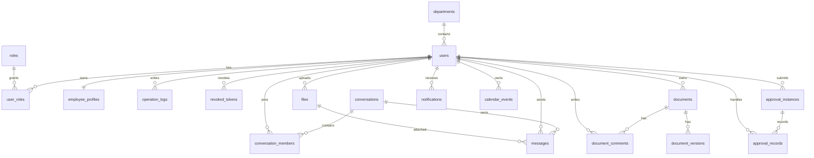

# 后端核心数据模型设计

## 一、设计目标

本后端数据库用于支撑仿飞书 MVP 的统一总端能力，核心目标是让电脑端、移动端和后续其他端共用同一套用户、通讯录、IM、文档、云盘、审批、日历、通知和日志数据。

数据库采用 PostgreSQL，业务实体通过 EF Core 统一管理，当前上下文为：

```text
backend/src/FangFeishu.Api/Data/AppDbContext.cs
```

## 二、核心 ER 图



## 三、表结构汇总

| 模块 | 表名 | 说明 |
| :-- | :-- | :-- |
| 用户权限 | `users` | 登录账号、姓名、联系方式、部门、状态 |
| 用户权限 | `roles` | 系统角色，目前主要为 `Admin`、`User` |
| 用户权限 | `user_roles` | 用户与角色多对多关系 |
| 用户权限 | `revoked_tokens` | 已退出登录的 JWT Token 记录 |
| 用户权限 | `operation_logs` | 管理员和业务操作日志 |
| 通讯录 | `departments` | 部门树结构 |
| 通讯录 | `employee_profiles` | 员工职位、头像、办公地点、简介 |
| IM | `conversations` | 单聊和群聊会话 |
| IM | `conversation_members` | 会话成员与已读位置 |
| IM | `messages` | 聊天消息、文件消息、撤回状态 |
| 文档 | `documents` | 文档标题、正文、所有者、更新时间 |
| 文档 | `document_comments` | 文档评论 |
| 文档 | `document_versions` | 文档历史版本快照 |
| 云盘 | `files` | 文件元数据，物理文件由本地存储或 MinIO 保存 |
| 通知 | `notifications` | IM、审批和系统通知 |
| 日历 | `calendar_events` | 个人日程 |
| 审批 | `approval_instances` | 审批申请主表 |
| 审批 | `approval_records` | 审批处理记录 |

## 四、关键索引与约束

| 表名 | 约束 / 索引 | 用途 |
| :-- | :-- | :-- |
| `users` | `Username` 唯一索引 | 保证账号唯一 |
| `roles` | `RoleCode` 唯一索引 | 保证角色编码唯一 |
| `user_roles` | `(UserId, RoleId)` 唯一索引 | 防止重复分配同一角色 |
| `employee_profiles` | `UserId` 唯一索引 | 一个用户只对应一份员工档案 |
| `revoked_tokens` | `TokenId` 唯一索引 | 防止同一个 JWT 重复撤销 |
| `conversation_members` | `(ConversationId, UserId)` 唯一索引 | 防止会话成员重复 |

## 五、关联关系说明

| 关系 | 说明 |
| :-- | :-- |
| 用户与部门 | 用户可属于一个部门，部门删除时用户部门置空 |
| 用户与角色 | 用户和角色通过 `user_roles` 关联 |
| 用户与员工档案 | 一对一关系，扩展职位、头像、办公地点等信息 |
| 会话与成员 | 一个会话有多个成员，成员记录用于权限和已读状态 |
| 会话与消息 | 消息必须属于一个会话 |
| 消息与文件 | 消息可选关联一个云盘文件 |
| 文档与评论/版本 | 文档保存内容，评论和版本单独记录 |
| 审批与审批记录 | 审批主表保存状态，处理过程写入记录表 |

## 六、迁移文件

当前已生成 EF Core 迁移：

```text
backend/src/FangFeishu.Api/Data/Migrations/20260706080811_InitialCreate.cs
backend/src/FangFeishu.Api/Data/Migrations/AppDbContextModelSnapshot.cs
```

当前注意点：

```text
本地已经具备迁移文件，但启动种子逻辑仍使用 EnsureCreatedAsync。
后续如果要完全规范化，应将启动建表流程切换到 MigrateAsync，并由运维或后端统一执行 dotnet ef database update。
```

## 七、初始化数据

初始化逻辑位于：

```text
backend/src/FangFeishu.Api/Data/DbSeeder.cs
```

已初始化内容包括：

1. `admin`、`user_a`、`user_b`、`user_c`、`user_d` 五个测试账号。
2. `Admin`、`User` 两个基础角色。
3. 演示部门、单聊、群聊、文档、文件、日程、审批和通知。

## 八、当前结论

当前数据库模型已经能支撑本轮 MVP 的后端主流程，包括统一账号、统一通讯录、统一 IM、统一文档、统一云盘、统一审批、统一日历、统一通知和统一日志。

剩余可优化点主要是：

1. 将运行时建表从 `EnsureCreatedAsync` 收口到 EF Core Migration。
2. 补充更完整的数据库截图或 ER 图导出图片。
3. 根据正式部署环境补充初始化 SQL 或数据重置脚本。
