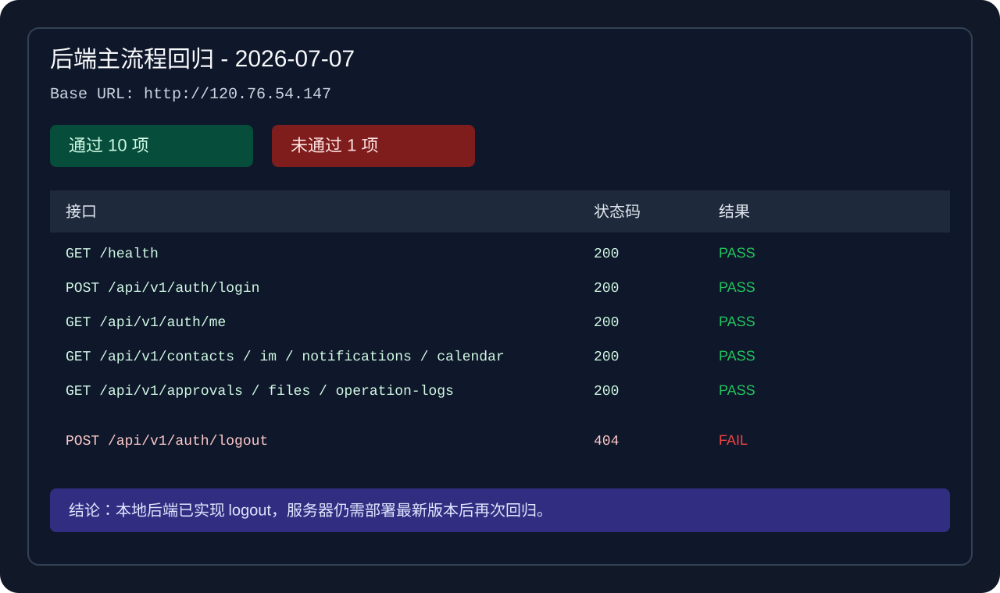

# 后端主流程回归测试 - 2026-07-07

## 一、测试范围

本次回归用于验证服务器联调环境中后端主流程接口是否可用。

测试地址：

```text
API Base URL: http://120.76.54.147
Swagger:      http://120.76.54.147/swagger/index.html
Health:       http://120.76.54.147/health
```

测试账号：

```text
admin / 123456
```

## 二、测试策略

| 类型 | 工具 | 说明 |
| :-- | :-- | :-- |
| 健康检查 | PowerShell / HTTP | 验证服务是否在线 |
| 登录鉴权 | PowerShell / HTTP | 登录后获取 JWT Token |
| 主流程接口 | PowerShell / HTTP | 带 Token 请求核心模块 |
| 问题定位 | 状态码 + 返回结果 | 记录失败接口和阻塞点 |

## 三、测试结果



| 序号 | 方法 | 接口 | 状态码 | 结果 | 说明 |
| :-- | :-- | :-- | :-- | :-- | :-- |
| 1 | `GET` | `/health` | `200` | 通过 | 健康检查正常 |
| 2 | `POST` | `/api/v1/auth/login` | `200` | 通过 | 管理员登录正常 |
| 3 | `GET` | `/api/v1/auth/me` | `200` | 通过 | 当前用户接口正常 |
| 4 | `GET` | `/api/v1/contacts` | `200` | 通过 | 通讯录列表正常 |
| 5 | `GET` | `/api/v1/im/conversations` | `200` | 通过 | IM 会话列表正常 |
| 6 | `GET` | `/api/v1/notifications/unread-count` | `200` | 通过 | 通知未读数正常 |
| 7 | `GET` | `/api/v1/calendar/events` | `200` | 通过 | 日历列表正常 |
| 8 | `GET` | `/api/v1/approvals` | `200` | 通过 | 审批列表正常 |
| 9 | `GET` | `/api/v1/files` | `200` | 通过 | 云盘文件列表正常 |
| 10 | `GET` | `/api/v1/operation-logs` | `200` | 通过 | 操作日志列表正常 |
| 11 | `POST` | `/api/v1/auth/logout` | `404` | 未通过 | 服务器尚未部署最新后端 |

## 四、缺陷清单

| Bug ID | 标题 | 等级 | 状态 | 处理建议 |
| :-- | :-- | :-- | :-- | :-- |
| BUG-BE-20260707-001 | 线上 `POST /api/v1/auth/logout` 返回 404 | P1 | 待部署验证 | 运维重新部署最新后端后回归 |

## 五、风险与遗留

当前大部分服务器主流程接口可用，但 `logout` 未通过。由于本地代码已经实现该接口，判断为服务器部署版本未同步，而不是后端源码缺失。

后续需要：

1. 运维重新部署最新后端。
2. 部署后重新验证 `POST /api/v1/auth/logout`。
3. 验证登出后旧 Token 访问受保护接口是否返回 `401`。
4. 继续补充 IM 发送消息、文件上传下载、审批提交和日历新增等写操作回归。

## 六、测试结论

本次服务器主流程回归结果：

```text
通过：10 项
未通过：1 项
主要阻塞：线上后端未同步最新版本，logout 接口仍为 404
```
